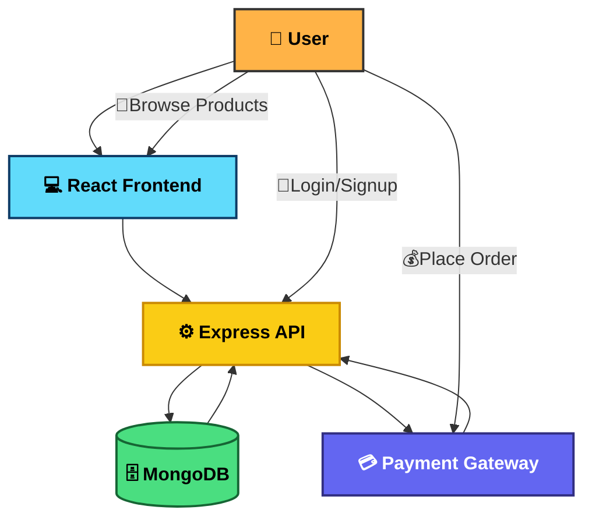

# 🛒 Full-Stack E-Commerce Platform


 

---

## 📖 About The Project

The **E-Commerce Platform** is a feature-rich, full-stack web application built to deliver a **modern online shopping experience**.  
It enables users to **browse products, add them to a cart, complete secure checkout with payments, and track orders**, while administrators have tools to **manage inventory, customers, and sales**.

Built with the **MERN stack (MongoDB, Express, React, Node.js)** and styled with **TailwindCSS**, the platform ensures **speed, scalability, and responsive design**.

---

## ✨ Features

- 🔐 **Authentication & Authorization** – Secure JWT-based login/signup with role management.  
- 🛍 **Product Catalog** – Browse, search, filter, and view product details.  
- 🛒 **Cart & Checkout** – Add/remove/update products, calculate totals, and checkout.  
- 💳 **Payments Integration** – Razorpay for smooth and secure transactions.  
- 📦 **Order Tracking** – Real-time order history and tracking.  
- 🛠 **Admin Dashboard** – Manage products, categories, users, and orders.  
- 📱 **Responsive Design** – Fully optimized for desktop, tablet, and mobile.  
- 📧 **Email Notifications** (planned) – Order confirmations, password resets, and more.  

---

## 📁 Directory Structure

```

Directory structure:
└──  e-commerce/
    ├── LICENSE
    ├── client/
    │   ├── package.json
    │   ├── tailwind.config.js
    │   ├── public/
    │   │   ├── index.html
    │   │   ├── manifest.json
    │   │   └── robots.txt
    │   └── src/
    │       ├── App.js
    │       ├── App.test.js
    │       ├── index.css
    │       ├── index.js
    │       ├── reportWebVitals.js
    │       ├── setupTests.js
    │       ├── app/
    │       │   ├── constants.js
    │       │   └── store.js
    │       ├── features/
    │       │   ├── admin/
    │       │   │   └── components/
    │       │   │       ├── AdminOrderDetail.js
    │       │   │       ├── AdminOrders.js
    │       │   │       ├── AdminProductDetail.js
    │       │   │       ├── AdminProductList.js
    │       │   │       └── ProductForm.js
    │       │   ├── auth/
    │       │   │   ├── authAPI.js
    │       │   │   ├── authSlice.js
    │       │   │   └── components/
    │       │   │       ├── ForgotPassword.js
    │       │   │       ├── Login.js
    │       │   │       ├── Logout.js
    │       │   │       ├── Protected.js
    │       │   │       ├── ProtectedAdmin.js
    │       │   │       ├── ResetPassword.js
    │       │   │       └── Signup.js
    │       │   ├── brands/
    │       │   │   ├── brandsAPI.js
    │       │   │   └── brandSlice.js
    │       │   ├── cart/
    │       │   │   ├── Cart.js
    │       │   │   ├── cartAPI.js
    │       │   │   └── cartSlice.js
    │       │   ├── category/
    │       │   │   ├── categoryAPI.js
    │       │   │   └── categorySlice.js
    │       │   ├── common/
    │       │   │   └── components/
    │       │   │       ├── Footer.js
    │       │   │       ├── Modal.js
    │       │   │       └── Pagination.js
    │       │   ├── navbar/
    │       │   │   └── Navbar.js
    │       │   ├── order/
    │       │   │   ├── orderAPI.js
    │       │   │   └── orderSlice.js
    │       │   ├── payment/
    │       │   │   ├── paymentAPI.js
    │       │   │   └── paymentSlice.js
    │       │   ├── product/
    │       │   │   ├── productAPI.js
    │       │   │   ├── productSlice.js
    │       │   │   └── components/
    │       │   │       ├── ProductDetail.js
    │       │   │       └── ProductList.js
    │       │   └── user/
    │       │       ├── userAPI.js
    │       │       ├── userSlice.js
    │       │       └── components/
    │       │           ├── UserOrders.js
    │       │           └── UserProfile.js
    │       └── pages/
    │           ├── 404.js
    │           ├── AdminHome.js
    │           ├── AdminOrderDetailPage.js
    │           ├── AdminOrdersPage.js
    │           ├── AdminProductDetailPage.js
    │           ├── AdminProductFormPage.js
    │           ├── CartPage.js
    │           ├── Checkout.js
    │           ├── ForgotPasswordPage.js
    │           ├── Home.js
    │           ├── LoginPage.js
    │           ├── OrderSuccessPage.js
    │           ├── ProductDetailPage.js
    │           ├── ResetPasswordPage.js
    │           ├── SignupPage.js
    │           ├── UserOrdersPage.js
    │           └── UserProfilePage.js
    └── server/
        ├── index.js
        ├── package.json
        ├── pnpm-lock.yaml
        ├── .env.sample
        ├── controllers/
        │   ├── Auth.Controller.js
        │   ├── Brand.Controller.js
        │   ├── Cart.Controller.js
        │   ├── Category.Controller.js
        │   ├── Mail.Controller.js
        │   ├── Order.Controller.js
        │   ├── Payment.Controller.js
        │   ├── Product.Controller.js
        │   └── User.Controller.js
        ├── models/
        │   ├── Brand.Model.js
        │   ├── Cart.Model.js
        │   ├── Category.Model.js
        │   ├── Order.Model.js
        │   ├── Payment.Model.js
        │   ├── Product.Model.js
        │   └── User.Model.js
        ├── routes/
        │   ├── Auth.Routes.js
        │   ├── Brand.Routes.js
        │   ├── Cart.Routes.js
        │   ├── Category.Routes.js
        │   ├── Mail.Routes.js
        │   ├── Order.Routes.js
        │   ├── Payment.Routes.js
        │   ├── Product.Routes.js
        │   └── User.Routes.js
        ├── services/
        │   ├── Common.js
        │   └── Mails/
        │       ├── ConfirmationMail.js
        │       ├── ResetMail.js
        │       ├── SendEMail.js
        │       └── WelcomMail.js
        └── utils/
            └── connectDB.js

````

---

## 🏗️ Architecture

The system is designed for **scalability, modularity, and performance**.  

- **Frontend:** React + TailwindCSS for modern, fast UI.  
- **Backend:** Node.js + Express for REST APIs.  
- **Database:** MongoDB with Mongoose.  
- **Authentication:** JWT-based security.  
- **Payments:** Integrated Razorpay.  



---

## ⚙️ Getting Started

### Prerequisites

* Node.js v18+
* MongoDB instance (local/Atlas)
* Payment Gateway API keys

### Installation

```bash
git clone https://github.com/Abhinay-Sikarwar/e-commerce.git
cd your-repo
```

Install client dependencies:

```bash
cd client
npm install
```

Install server dependencies:

```bash
cd ../server
npm install
```

### Configuration

Create a `.env` in **server/**:

```env
MONGO_URI=your_mongo_connection_string
JWT_SECRET=your_jwt_secret
PAYMENT_GATEWAY_KEY=your_payment_key
```

### Run Development Servers

Backend:

```bash
cd server
npm run dev
```

Frontend:

```bash
cd client
npm start
```

Now open 👉 [http://localhost:3000](http://localhost:3000)

---

## 🛣️ Roadmap

* [x] Authentication (JWT)
* [x] Product Management
* [x] Cart & Checkout
* [x] Payments Integration
* [ ] Email Notifications
* [ ] Analytics Dashboard
* [ ] Multi-language Support

---

## 📜 License

MIT License © 2025 [Abhinay-Sikarwar]

---

## 📬 Contact

👨‍💻 **Abhinay Sikarwar**

📧 **[abhinaysikarwar1234@gmail.com](mailto:abhinaysikarwar1234@gmail.com)**

---

### ⭐ Support

If you like this project, please **star it on GitHub ⭐** and share feedback!

---
